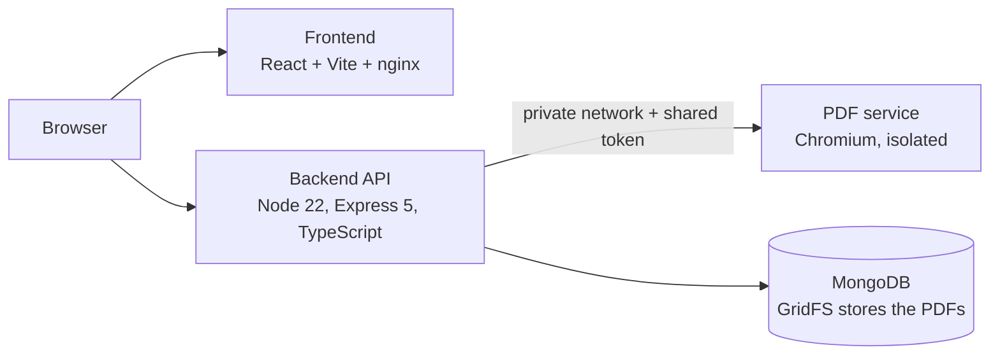

# DocFlow

[](https://github.com/RStephanH/docflow/actions/workflows/ci-cd.yml)

DocFlow is a full-stack document management platform designed to digitalize administrative processes.

It is also a deliberate **DevSecOps exercise**: each architectural choice below has a security reason, and the CI/CD pipeline enforces it on every push.

> **Live demo:** coming soon. Deployment on Render is in progress (see [Project status](#project-status)).

## Features

- Automated generation of administrative documents
- Dynamic PDF creation, stored in MongoDB GridFS
- Simulated electronic signature workflow (retry with backoff and a circuit breaker)
- Monitoring dashboard (generation time, error count, circuit breaker state)
- JWT authentication, rate limiting and structured JSON logs
- Containerized deployment with Docker and a CI/CD pipeline with GitHub Actions

## Architecture



```text
backend/           Express API (TypeScript) and Jest tests
frontend/          React + Vite, served by nginx
pdf-service/       Isolated Chromium rendering service
docker-compose.yml Local stack (the PDF service publishes no port)
render.yaml        Render blueprint (deployment in progress)
init.sh            Local bootstrap
.github/workflows/ CI/CD pipeline and weekly security scan
```

### Why the PDF service is separate

Chromium is the only component that renders HTML, and it carries dozens of known flaws that no vendor patch covers yet.
Keeping it inside the API image made the whole backend inherit them. Splitting it out means:

- the API image stays minimal and passes the vulnerability gate;
- Chromium runs in its own container, with no database access and no application secrets;
- the service is reachable only from the internal network, and only with a token.

## Security decisions

| Area | Decision |
|---|---|
| PDF rendering | Isolated service, token-protected, no published port, JavaScript disabled, every outbound request from the page blocked (SSRF protection) |
| Input handling | User text is HTML-escaped before rendering; login accepts strings only (blocks NoSQL operator injection) |
| Secrets | No credentials in the code or in Git: everything comes from the environment, and the API refuses to start without them (validated with Zod) |
| Authentication | JWT, constant-time password comparison, strict rate limit on failed logins |
| Abuse protection | Global rate limit, plus a cap on PDF generation because every PDF is stored |
| Images | Multi-stage builds, non-root user, npm removed from the runtime image |
| Supply chain | Trivy scan in CI blocks the build on fixable HIGH/CRITICAL findings; published images are rescanned weekly |

### Vulnerability scan: before and after

| | Single image with Chromium (initial scan) | After the split |
|---|---|---|
| Backend image | 155 OS findings (148 HIGH, 7 CRITICAL) plus 10 HIGH npm findings | The gate passes with no HIGH/CRITICAL finding, unfixed ones included |
| PDF service | n/a | No fixable HIGH/CRITICAL finding; unfixed Chromium findings are isolated and monitored weekly |

### Known trade-offs

- **Chromium runs with `--no-sandbox`** (`CHROMIUM_NO_SANDBOX=true`). Docker's default profile prevents Chromium from building its sandbox, and the target platform does not let us change it. This is compensated by JavaScript disabled, blocked network, a non-root user, no secrets in the container and a private network. The default stays sandbox **on**: disabling it is an explicit choice.
- **Authentication is a demonstration mock.** Two accounts (`admin` and `user`) whose passwords come from the environment. A real deployment needs a user store and hashed passwords.
- **Documents have no owner.** Every authenticated user sees every document: do not enter sensitive data in the demo.
- **CORS currently allows any origin.** The API uses a bearer token, not cookies, which limits the risk; restricting it to the frontend origin is planned.
- **No delete route yet.** Stored PDFs only grow, which is why generation is rate-limited.

## Run locally

Requirements: Docker with Compose, and `openssl`.

```bash
./init.sh
```

The script creates a `.env` with random secrets (if missing), builds and starts the stack, and waits until every service is healthy.

| Service | URL |
|---|---|
| Frontend | <http://localhost:8080> |
| API | <http://localhost:3000> |

Log in with `admin@docflow.fr` or `user@docflow.fr`; the passwords are `DEMO_ADMIN_PASSWORD` and `DEMO_USER_PASSWORD` in your `.env`.

Run the tests:

```bash
cd backend && npm test      # Jest
cd frontend && npm test     # Vitest
```

### Environment variables

| Variable | Used by | Purpose |
|---|---|---|
| `JWT_SECRET` | backend | Signs the tokens (32 characters minimum) |
| `DEMO_ADMIN_PASSWORD`, `DEMO_USER_PASSWORD` | backend | Passwords of the two demo accounts |
| `MONGODB_URI` | backend | MongoDB connection string |
| `PDF_SERVICE_HOSTPORT` | backend | Host and port of the PDF service |
| `PDF_SERVICE_TOKEN` | backend, pdf-service | Shared secret between the two |
| `CHROMIUM_NO_SANDBOX` | pdf-service | Runs Chromium without its sandbox (see trade-offs) |
| `PORT`, `LOG_LEVEL` | all | Listening port and log verbosity |

`.env.example` lists the names without values.

## API

| Method | Path | Auth | Purpose |
|---|---|---|---|
| `GET` | `/health` | no | Health check |
| `POST` | `/auth/login` | no | Returns a JWT |
| `POST` | `/api/documents/generate` | yes | Generates and stores a PDF |
| `GET` | `/api/documents` | yes | Paginated list, newest first |
| `GET` | `/api/metrics` | yes | Generation time, errors, circuit breaker state |

## CI/CD

On every push, `.github/workflows/ci-cd.yml` runs:

1. **Lint and tests** for the backend and the frontend.
2. **Build** of the backend and PDF service images, each followed by a **Trivy scan** that fails the pipeline on fixable HIGH/CRITICAL findings.
3. **Publication** of the images to GitHub Container Registry, tagged with the commit SHA.
4. **Deployment to Render** through deploy hooks, on `master` only and behind the `DEPLOY_ENABLED` repository variable.

A second workflow, `security-scan.yml`, rescans the published images every week. A failure there means a fix now exists for a flaw that had none when the image was built.

## Project status

| Area | Status |
|---|---|
| Backend API, frontend, PDF generation with GridFS storage | Done |
| Isolated PDF service and hardened images | Done |
| CI pipeline with vulnerability gate and image publication | Done |
| Secrets moved out of the code, fail-fast configuration | Done |
| Deployment on Render (private PDF service, MongoDB Atlas) | In progress |
| Trivy scan for the frontend image | Planned |
| CORS restricted to the frontend origin | Planned |
| Document ownership and a scheduled clean-up of old PDFs | Planned |
| Unit tests for the PDF service client | Planned |

## Demo account

To be published with the live demo: `user@docflow.fr` with a dedicated password. The admin account stays private.
